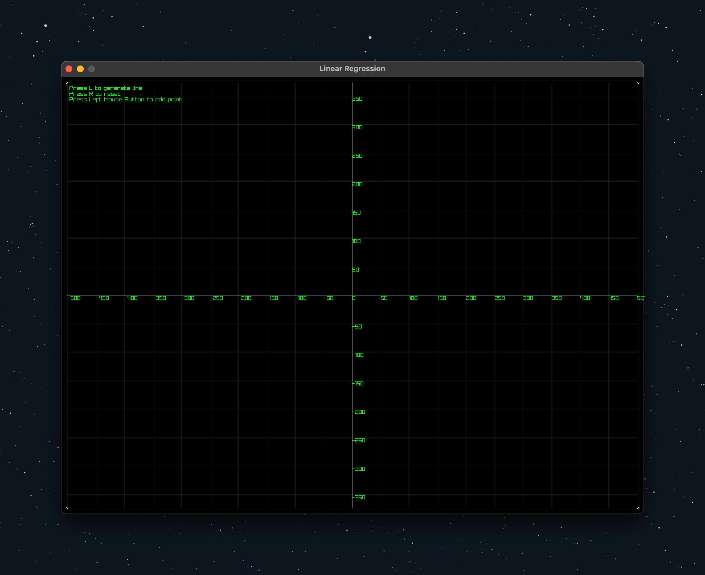
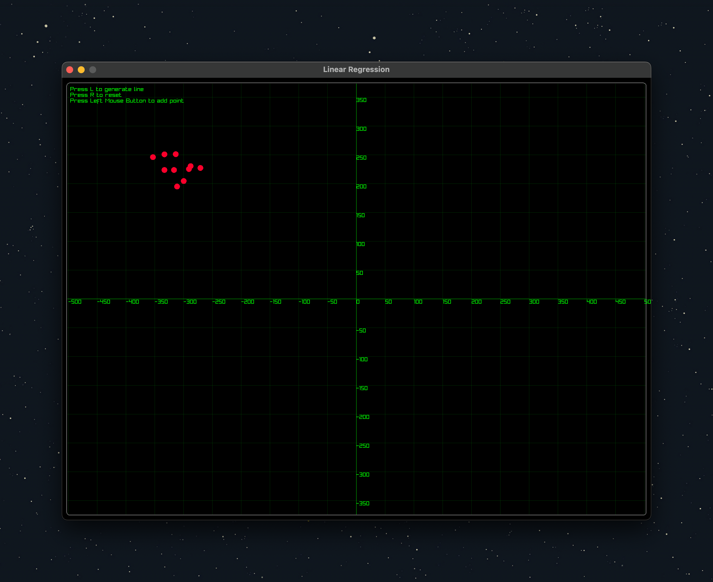
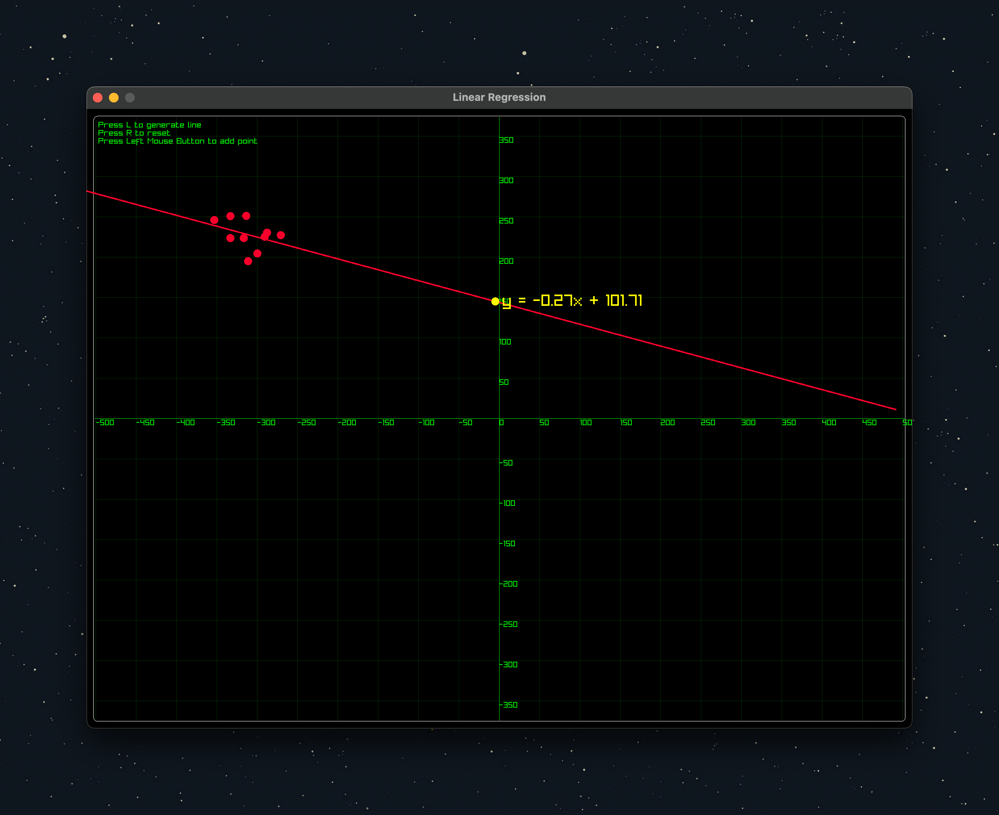
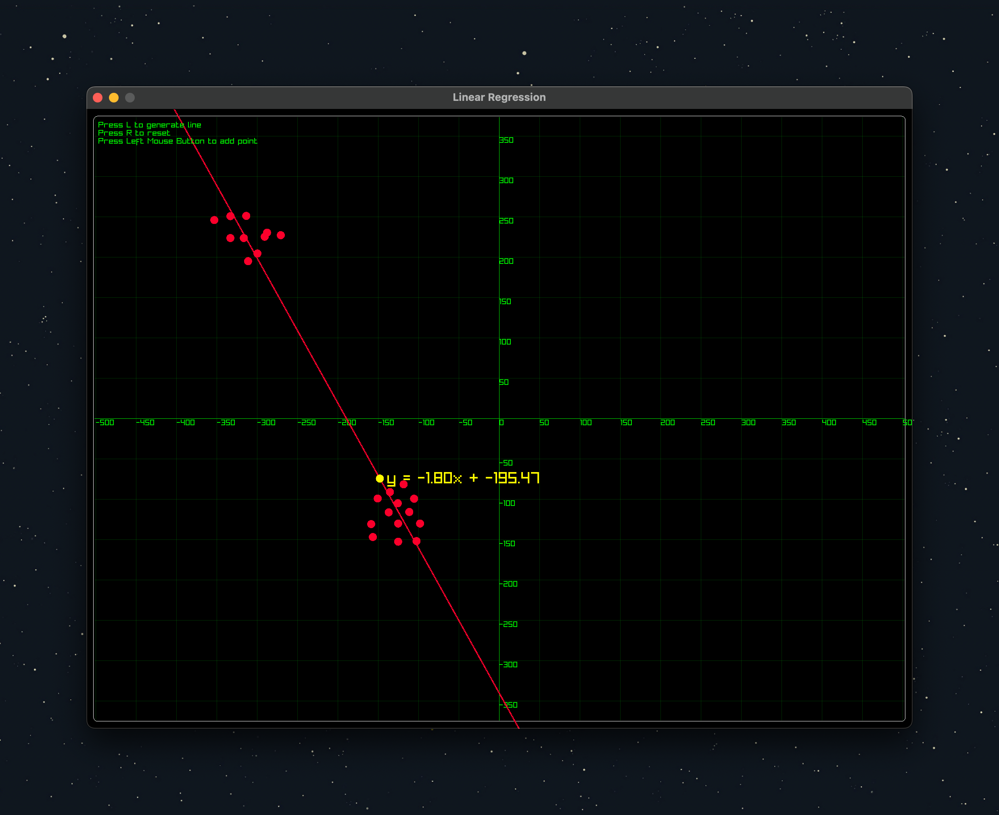

# A Linear Regression Visualization using C++ and Raylib

This is a simple linear regression visualization using C++ and Raylib. The user puts random data points and then uses linear regression to find the best fit line. The best fit line is then drawn on the screen using Raylib.

## How to run

1. Run the following commands:

```bash
git clone --recursive https://github.com/burakssen/linear_regression.git
cd linear_regression
mkdir build
cd build
cmake ..
make
./linear_regression
```

## How to use

1. Click on the screen to put random data points.
2. Press `l` to find the best fit line using linear regression.
3. Press `r` to reset the screen.

## Screenshot

|  |  |
| -------------------------------- | -------------------------------- |
|  |  |

## Author

- @burakssen

## Used Libraries

- [Raylib](https://github.com/raysan5/raylib)
